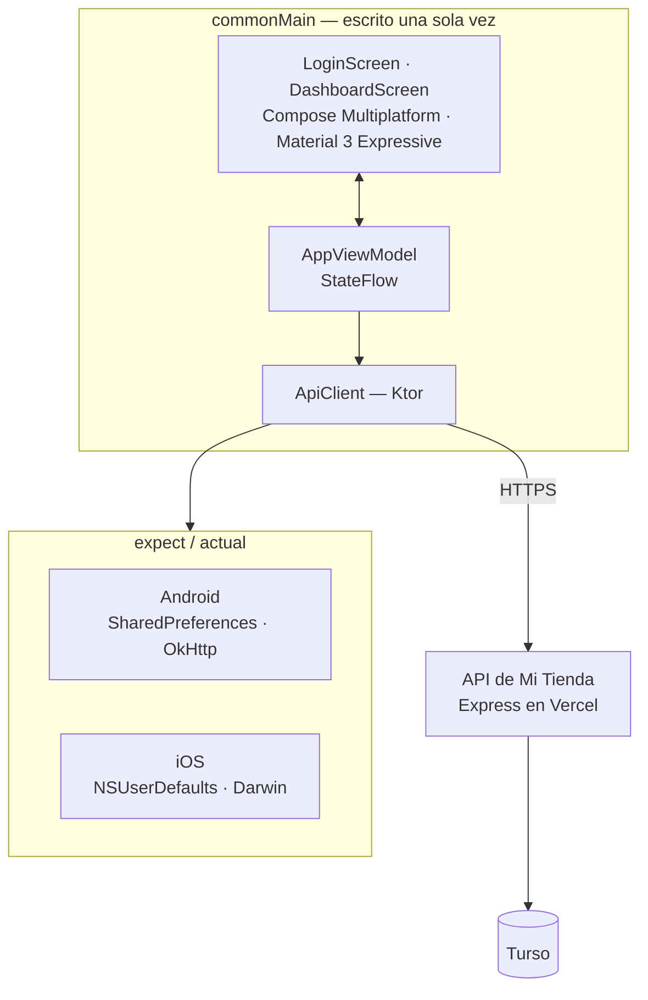

# Al Día — panel del dueño para MIPYMES cubanas

> Una app pequeña a propósito, para Android e iOS, que le responde al dueño de un negocio cubano
> una sola pregunta: *¿cómo fue el día?* — y le deja cambiar los dos números que realmente
> controla. Un solo código Kotlin, una sola UI en Compose, las dos plataformas.


🇬🇧 **[Read this in English](./README.md)** · 🏪 [El sistema POS con el que se conecta](https://github.com/brianmojena/al-dia-pos)

---

## Qué es

Es la app complementaria de [**Mi Tienda**](https://github.com/brianmojena/al-dia-pos), un
sistema de punto de venta para negocios pequeños en Cuba. El POS lo usa quien esté en la caja.
Esta app es para quien *es dueño* del negocio y normalmente está en otro lado.

Ese encuadre guió todas las decisiones. No es un port móvil del POS. No gestiona productos, no
cobra, no arma reportes. Tiene:

- **Los números del día** — ventas, ganancia estimada, cantidad de ventas.
- **Alertas de stock bajo** — qué está por acabarse.
- **Últimas ventas**, desplegables al tocarlas para ver qué se vendió, línea por línea.
- **Dos ajustes editables** — el máximo que el negocio acepta por transferencia, y la tasa del
  dólar que se está aplicando. Los dos surten efecto en la caja de inmediato.

Esos dos últimos son el punto. En Cuba los precios van en CUP, la tasa informal del dólar se
mueve de una semana a otra, y las transferencias tienen topes prácticos. Esas decisiones son del
dueño, no del dependiente — así que viven en el teléfono del dueño, y el POS las lee.

---

## Por qué Kotlin Multiplatform

El dueño puede tener un Android o un iPhone; no hay forma de saberlo de antemano. Las
alternativas eran escribir la pantalla dos veces, o meter un WebView.

Compose Multiplatform comparte **la UI misma**, no solo la lógica: el mismo `DashboardScreen.kt`
se renderiza en las dos plataformas. Lo que queda específico de cada plataforma es exactamente
lo que tiene que serlo, expresado con `expect`/`actual`:

| Aspecto | Android | iOS |
|---|---|---|
| Sesión persistida | `SharedPreferences` | `NSUserDefaults` |
| Motor HTTP | Ktor OkHttp | Ktor Darwin |
| Punto de entrada | `MainActivity` | `MainViewController` → `ContentView` en SwiftUI |

Todo lo demás — modelos, cliente de API, view model, las dos pantallas — está escrito una sola
vez en `commonMain`.

La interfaz usa **Material 3 Expressive** (`MaterialExpressiveTheme`), que todavía está en
alpha. Es un compromiso deliberado: el usuario objetivo no es una persona técnica, y las áreas
táctiles más grandes, el lenguaje de formas más marcado y el movimiento más claro de los
componentes expresivos hacen que la app se lea de un vistazo en un teléfono sostenido con una
mano detrás de un mostrador.

---

## Arquitectura



```
shared/src/
  commonMain/kotlin/org/atlas/aldia/
    App.kt                      Tema + enrutado según el estado de sesión
    data/Models.kt              DTOs @Serializable que espejan el JSON del backend
    data/ApiClient.kt           Cliente Ktor; toda llamada devuelve ApiResult<T>
    data/TokenStorage.kt        expect class
    viewmodel/AppViewModel.kt   Estado de sesión y dashboard, expuesto como StateFlow
    ui/LoginScreen.kt
    ui/DashboardScreen.kt
    ui/Format.kt                Formato de CUP
  androidMain/…/TokenStorage.android.kt
  iosMain/…/TokenStorage.ios.kt

androidApp/    Punto de entrada de Android
iosApp/        Proyecto de Xcode + host SwiftUI
```

La app es un cliente de la **misma API** que usan el POS web y el de escritorio — no es un
sistema aparte ni una base de datos aparte. Los nombres de campo en `Models.kt` espejan
exactamente el `snake_case` del backend, así que no hay que traducir nada en la frontera.

---

## Detalles que vale la pena leer

### `ApiResult<T>` — un solo tipo de fallo, no dos

En Ktor, una excepción de red y un status HTTP de error son cosas distintas, y si no cada
pantalla tendría que manejar las dos. `ApiClient` las colapsa en la frontera:

```kotlin
sealed class ApiResult<out T> {
    data class Success<T>(val data: T) : ApiResult<T>()
    data class Failure(val message: String, val statusCode: Int? = null) : ApiResult<Nothing>()
}
```

Una conexión caída y un `500` llegan al view model con la misma forma, ya con un mensaje que el
dueño puede leer.

### `null` no es `0`

`transfer_limit` y `usd_rate` son nullable de punta a punta: `NULL` significa *el dueño todavía
no lo configuró*, que no es lo mismo que *el límite es cero*. Mostrar un límite sin configurar
como `0` le diría al dependiente que nunca se acepta una transferencia. Los valores sin definir
no muestran chip alguno, y vaciar un campo guarda `null` a propósito — es como el dueño quita un
límite que ya no quiere.

### El formulario que no recordaba lo guardado

El formulario de ajustes se precargaba con el objeto `User` capturado **al iniciar sesión**.
Guardabas un límite nuevo, salías de la pantalla, volvías — y el campo estaba vacío otra vez,
mientras que el POS (que vuelve a pedir `/me` al cargar) sí mostraba el valor guardado. Los
datos estaban bien; el formulario leía una copia vieja en memoria.

El arreglo hace que el camino de refresco vuelva a pedir `/me` en vez de confiar en lo que ya
tiene, y que `saveSettings()` resincronice los campos con lo que el servidor confirmó, no con lo
que se tipeó:

```kotlin
// userHint: se lo pasan login()/checkSession(), que ACABAN de pedir /me y tienen
// el usuario fresco a mano. Sin hint (o sea, desde refreshDashboard()) se vuelve
// a pedir a propósito — es la única forma de garantizar que el formulario muestre
// lo que de verdad está guardado.
private fun loadDashboard(userHint: User? = null) { … }
```

### Una colisión de keys en LazyColumn que cerraba la app

Al hacer scroll hasta el historial de ventas, la app se cerraba con
`IllegalArgumentException: Key "22" was already used`. Las dos listas usaban `key = { it.id }` —
y `products.id` y `sales.id` son secuencias autoincrementales independientes, así que la
colisión era cuestión de tiempo. Compose exige claves únicas en **todo** el `LazyColumn`, no por
bloque `items()`. Con un prefijo quedó resuelto:

```kotlin
items(state.lowStock,    key = { "product-${it.id}" }) { … }
items(state.recentSales, key = { "sale-${it.id}"    }) { … }
```

### El detalle de venta se pide una vez y se cachea

Tocar una venta pide `GET /api/sales/:id` una sola vez y guarda las líneas en un
`Map<Long, List<SaleItem>>`, así colapsarla y volver a abrirla no cuesta nada. Solo hay una
venta desplegada a la vez.

---

## Stack

| | |
|---|---|
| Lenguaje | Kotlin 2.4.10 (Multiplatform) |
| UI | Compose Multiplatform 1.11.1, Material 3 `1.11.0-alpha07` (Expressive) |
| Red | Ktor 3.5.1 — OkHttp en Android, Darwin en iOS |
| Serialización | kotlinx.serialization 1.11.0 |
| Estado | `ViewModel` + `StateFlow`, AndroidX Lifecycle multiplataforma |
| Targets | Android (minSdk 24) · iOS |

`material-icons-extended` va pinneado aparte en `1.7.3` — dejó de seguir el tren de releases de
Compose Multiplatform, y dejar que Gradle lo resuelva solo arrastra transitivos viejos de
`foundation`/`ui` que rompen `RowColumnParentData.weight` en tiempo de ejecución.

---

## Cómo ejecutarlo

```bash
git clone https://github.com/brianmojena/al-dia-dashboard.git
cd al-dia-dashboard
```

**Android**

```bash
./gradlew :androidApp:assembleDebug
```

**iOS** — abre `iosApp/` en Xcode y ejecuta. Pon tu equipo de Apple Developer en `TEAM_ID`
dentro de `iosApp/Configuration/Config.xcconfig` para correr en un dispositivo físico; déjalo
vacío para el simulador.

Inicia sesión con una cuenta del [backend de Mi Tienda](https://github.com/brianmojena/al-dia-pos)
— la cuenta de prueba es `demo@mitienda.cu` / `demo1234`. La URL base de la API está en
`shared/src/commonMain/kotlin/org/atlas/aldia/data/ApiClient.kt`.

> En macOS, mantén el proyecto fuera de `~/Documents` y `~/Desktop`. Esos directorios están bajo
> protección TCC y el daemon de Gradle falla ahí con `Operation not permitted`.

---

## Estado

Funcional y en desarrollo activo. Todavía sin suite de pruebas automatizadas. El panel es de
solo lectura casi por completo, a propósito: crear productos y cobrar se quedan en el POS, que
es donde corresponden.

## Licencia

[MIT](./LICENSE) © Brian Mojena
