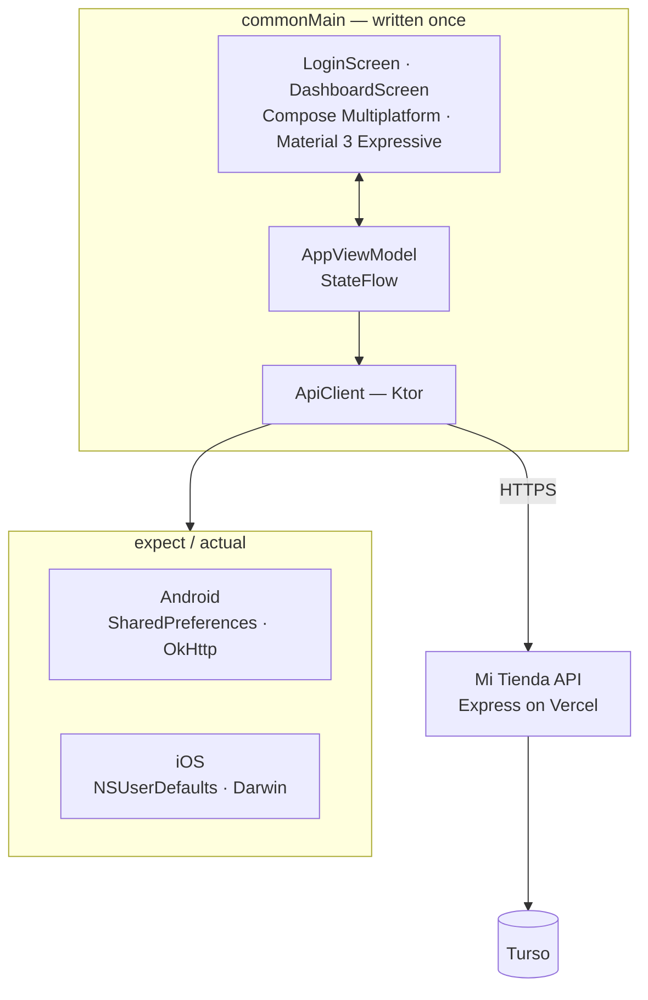

# Al Día — owner dashboard for Cuban MIPYMES

> A deliberately small Android + iOS app that answers one question for the owner of a Cuban
> shop: *how did today go?* — and lets them change the two numbers they actually control.
> One Kotlin codebase, one Compose UI, both platforms.


🇪🇸 **[Léeme en español](./README.es.md)** · 🏪 [The POS system this connects to](https://github.com/brianmojena/al-dia-pos)

---

## What it is

This is the companion app to [**Mi Tienda**](https://github.com/brianmojena/al-dia-pos), a
point-of-sale system for Cuban small businesses. The POS is used by whoever is at the register.
This app is for the person who *owns* the shop and is usually somewhere else.

That framing drove every decision. It is not a mobile port of the POS. It has no product
management, no checkout, no reports builder. It has:

- **Today's numbers** — revenue, estimated profit, number of sales.
- **Low-stock alerts** — what's about to run out.
- **Recent sales**, tappable to expand into what was actually sold, line by line.
- **Two editable settings** — the maximum the shop will accept by bank transfer, and the USD
  exchange rate being applied. Both take effect at the register immediately.

Those last two are the point. In Cuba prices are in CUP, the informal USD rate moves week to
week, and bank transfers have practical ceilings. Those decisions belong to the owner, not to
the cashier — so they live on the owner's phone, and the POS reads them.

---

## Why Kotlin Multiplatform

The owner might have an Android phone or an iPhone; there is no way to know in advance. The
alternatives were writing the screen twice, or shipping a web view.

Compose Multiplatform shares **the UI itself**, not just the business logic — the same
`DashboardScreen.kt` renders on both platforms. What stays platform-specific is exactly what has
to be, expressed through `expect`/`actual`:

| Concern | Android | iOS |
|---|---|---|
| Session storage | `SharedPreferences` | `NSUserDefaults` |
| HTTP engine | Ktor OkHttp | Ktor Darwin |
| Entry point | `MainActivity` | `MainViewController` → SwiftUI `ContentView` |

Everything else — models, API client, view model, both screens — is written once in
`commonMain`.

The UI is **Material 3 Expressive** (`MaterialExpressiveTheme`), which is still alpha. That's a
deliberate trade: the target user is not a software person, and the expressive components'
larger touch targets, stronger shape language and clearer motion make the app readable at a
glance on a phone that's being held one-handed behind a counter.

---

## Architecture



```
shared/src/
  commonMain/kotlin/org/atlas/aldia/
    App.kt                      Theme + top-level auth state routing
    data/Models.kt              @Serializable DTOs mirroring the backend's JSON
    data/ApiClient.kt           Ktor client; every call returns ApiResult<T>
    data/TokenStorage.kt        expect class
    viewmodel/AppViewModel.kt   Session + dashboard state, exposed as StateFlow
    ui/LoginScreen.kt
    ui/DashboardScreen.kt
    ui/Format.kt                CUP formatting
  androidMain/…/TokenStorage.android.kt
  iosMain/…/TokenStorage.ios.kt

androidApp/    Android entry point
iosApp/        Xcode project + SwiftUI host
```

The app is a client of the **same API** the web POS and desktop app use — not a separate
system, and not a separate database. Field names in `Models.kt` mirror the backend's `snake_case`
JSON exactly, so nothing needs translating at the boundary.

---

## Details worth reading

### `ApiResult<T>` — one failure type, not two

Network exceptions and HTTP error statuses are different things in Ktor, and every screen would
otherwise have to handle both. `ApiClient` collapses them at the boundary:

```kotlin
sealed class ApiResult<out T> {
    data class Success<T>(val data: T) : ApiResult<T>()
    data class Failure(val message: String, val statusCode: Int? = null) : ApiResult<Nothing>()
}
```

A dropped connection and a `500` arrive at the view model in the same shape, already carrying a
message the owner can read.

### `null` is not `0`

`transfer_limit` and `usd_rate` are nullable all the way through: `NULL` means *the owner hasn't
set this yet*, which is not the same as *the limit is zero*. Rendering an unset limit as `0`
would tell a cashier that no transfer is ever allowed. Unset values show no chip at all, and
clearing a field saves `null` on purpose — that's how the owner removes a limit they no longer
want.

### Settings form staleness — a bug worth explaining

The settings form was prefilled from the `User` object captured **at login**. Save a new
transfer limit, navigate away, come back — the field was empty again, while the POS (which
refetches `/me` on load) correctly showed the saved value. The data was fine; the form was
reading a stale in-memory copy.

The fix makes the refresh path re-fetch `/me` rather than trust what it already holds, and makes
`saveSettings()` resync the inputs from the server's confirmed response instead of from what was
typed:

```kotlin
// userHint: passed by login()/checkSession(), which just called /me and have a
// fresh user in hand. With no hint (i.e. from refreshDashboard()) we re-fetch on
// purpose — it's the only way to guarantee the form shows what is really stored.
private fun loadDashboard(userHint: User? = null) { … }
```

### A LazyColumn key collision that crashed the app

Scrolling to the sales history crashed with
`IllegalArgumentException: Key "22" was already used`. Both lists used `key = { it.id }` — and
`products.id` and `sales.id` are independent autoincrement sequences, so a collision was
inevitable. Compose requires keys unique across the *whole* `LazyColumn`, not per `items()`
block. Prefixing fixed it:

```kotlin
items(state.lowStock,    key = { "product-${it.id}" }) { … }
items(state.recentSales, key = { "sale-${it.id}"    }) { … }
```

### Sale detail is fetched lazily and cached

Tapping a sale fetches `GET /api/sales/:id` once and keeps the line items in a
`Map<Long, List<SaleItem>>`, so collapsing and reopening the same sale costs nothing. Only one
sale is expanded at a time.

---

## Stack

| | |
|---|---|
| Language | Kotlin 2.4.10 (Multiplatform) |
| UI | Compose Multiplatform 1.11.1, Material 3 `1.11.0-alpha07` (Expressive) |
| Networking | Ktor 3.5.1 — OkHttp on Android, Darwin on iOS |
| Serialization | kotlinx.serialization 1.11.0 |
| State | `ViewModel` + `StateFlow`, AndroidX Lifecycle multiplatform |
| Targets | Android (minSdk 24) · iOS |

`material-icons-extended` is pinned separately at `1.7.3` — it stopped following Compose
Multiplatform's release train, and letting Gradle resolve it normally drags in old
`foundation`/`ui` transitives that break `RowColumnParentData.weight` at runtime.

---

## Running it

```bash
git clone https://github.com/brianmojena/al-dia-dashboard.git
cd al-dia-dashboard
```

**Android**

```bash
./gradlew :androidApp:assembleDebug
```

**iOS** — open `iosApp/` in Xcode and run. Set `TEAM_ID` in
`iosApp/Configuration/Config.xcconfig` to your Apple Developer team to run on a physical device;
leave it empty for the simulator.

Sign in with an account from the [Mi Tienda backend](https://github.com/brianmojena/al-dia-pos)
— the demo account is `demo@mitienda.cu` / `demo1234`. The API base URL is in
`shared/src/commonMain/kotlin/org/atlas/aldia/data/ApiClient.kt`.

> On macOS, keep the project outside `~/Documents` and `~/Desktop`. Those directories are under
> TCC protection, and Gradle's daemon fails there with `Operation not permitted`.

---

## Status

Working, in active development. No automated test suite yet. The dashboard is read-mostly by
design — creating products and taking sales stay in the POS, where they belong.

## License

[MIT](./LICENSE) © Brian Mojena
